# Webhooks Guide

Webhooks allow you to receive real-time notifications when events occur in your X-Pay account, such as successful payments or refunds.

## How Webhooks Work

```mermaid
sequenceDiagram
    participant XPay as 🌐 X-Pay Server
    participant App as 🖥️ Your Server

    Note over XPay: Event occurs (payment, refund, etc.)
    XPay->>App: HTTP POST webhook event
    App->>App: Process event
    App-->>XPay: 200 OK
```



1. An event occurs (e.g., payment completes)
2. X-Pay sends an HTTP POST to your webhook URL
3. Your server processes the event
4. Your server responds with 200 OK

## Setting Up Webhooks

### Via Dashboard

1. Go to [Dashboard → Webhooks](https://dashboard.xpay-bits.com/webhooks)
2. Click **Add Webhook**
3. Enter your endpoint URL
4. Select events to subscribe to
5. Click **Create**

### Via API

```bash
curl -X POST https://server.xpay-bits.com/v1/developer/webhooks \
  -H "Authorization: Bearer sk_sandbox_your_key" \
  -H "Content-Type: application/json" \
  -d '{
    "url": "https://your-app.com/webhooks/xpay",
    "events": ["payment.completed", "payment.failed", "refund.completed"]
  }'
```

## Available Events

| Event               | Description              |
| ------------------- | ------------------------ |
| `payment.created`   | Payment initiated        |
| `payment.completed` | Payment successful       |
| `payment.failed`    | Payment failed           |
| `payment.cancelled` | Payment cancelled        |
| `refund.completed`  | Refund processed         |
| `webhook.created`   | Webhook endpoint created |

## Webhook Payload

All webhooks follow this structure:

```json
{
  "id": "evt_abc123",
  "event": "payment.completed",
  "created_at": "2025-01-01T10:00:30Z",
  "data": {
    "id": "pay_xyz789",
    "amount": 5000,
    "currency": "RWF",
    "status": "completed",
    "payment_method": "mobile_money",
    "phone_number": "+250788123456",
    "description": "Order #1234",
    "metadata": {
      "order_id": "1234"
    }
  }
}
```

## Handling Webhooks

### Node.js Example

```javascript
const express = require("express");
const app = express();

app.post("/webhooks/xpay", express.json(), (req, res) => {
  const { event, data } = req.body;

  switch (event) {
    case "payment.completed":
      handlePaymentSuccess(data);
      break;
    case "payment.failed":
      handlePaymentFailure(data);
      break;
    case "refund.completed":
      handleRefund(data);
      break;
    default:
      console.log("Unhandled event:", event);
  }

  // Always respond with 200 to acknowledge receipt
  res.status(200).json({ received: true });
});

function handlePaymentSuccess(payment) {
  console.log("Payment successful:", payment.id);
  // Fulfill the order
  // Send receipt email
  // Update your database
}

function handlePaymentFailure(payment) {
  console.log("Payment failed:", payment.id);
  // Notify user
  // Cancel order
}

function handleRefund(refund) {
  console.log("Refund processed:", refund.id);
  // Update order status
}
```

### Python Example

```python
from flask import Flask, request, jsonify

app = Flask(__name__)

@app.route('/webhooks/xpay', methods=['POST'])
def handle_webhook():
    event = request.json

    if event['event'] == 'payment.completed':
        handle_payment_success(event['data'])
    elif event['event'] == 'payment.failed':
        handle_payment_failure(event['data'])

    return jsonify({'received': True}), 200

def handle_payment_success(payment):
    print(f"Payment {payment['id']} completed!")
    # Your business logic here

def handle_payment_failure(payment):
    print(f"Payment {payment['id']} failed!")
    # Handle failure
```

## Best Practices

### 1. Respond Quickly

Return `200 OK` immediately, then process async:

```javascript
app.post("/webhooks/xpay", (req, res) => {
  // Respond immediately
  res.status(200).send("OK");

  // Process asynchronously
  setImmediate(() => {
    processWebhook(req.body);
  });
});
```

### 2. Handle Duplicates

Webhooks may be sent multiple times. Use idempotency:

```javascript
const processedEvents = new Set();

function processWebhook(event) {
  if (processedEvents.has(event.id)) {
    console.log("Duplicate event, skipping:", event.id);
    return;
  }

  processedEvents.add(event.id);
  // Process the event
}
```

### 3. Verify Webhooks (Coming Soon)

Verify webhook signatures to ensure authenticity:

```javascript
const crypto = require("crypto");

function verifyWebhook(payload, signature, secret) {
  const expected = crypto
    .createHmac("sha256", secret)
    .update(payload)
    .digest("hex");

  return signature === expected;
}
```

## Retry Policy

X-Pay retries failed webhooks:

| Attempt | Delay      |
| ------- | ---------- |
| 1       | Immediate  |
| 2       | 5 minutes  |
| 3       | 30 minutes |
| 4       | 2 hours    |
| 5       | 24 hours   |

After 5 failed attempts, the webhook is marked as failed. You can view failed webhooks in your dashboard.

## Testing Webhooks

### Using Dashboard

1. Go to Webhooks in your dashboard
2. Click on a webhook endpoint
3. Click **Test Webhook**
4. Check your server logs

### Using ngrok for Local Development

```bash
# Start ngrok
ngrok http 3000

# Use the ngrok URL as your webhook endpoint
# https://abc123.ngrok.io/webhooks/xpay
```

## Troubleshooting

| Issue                  | Solution                         |
| ---------------------- | -------------------------------- |
| Not receiving webhooks | Check URL is publicly accessible |
| 500 errors             | Check server logs for exceptions |
| Duplicate events       | Implement idempotency checks     |
| Timeouts               | Respond quickly, process async   |
