# Payments Overview

X-Pay provides a unified API to accept payments through multiple channels including Mobile Money, bank transfers, and card payments.

## Payment Flow

```mermaid
sequenceDiagram
    participant C as 👤 Customer<br>(Your App)
    participant X as 🔷 X-Pay API
    participant P as 🏦 Provider<br>(MTN, Stripe, etc.)

    C->>X: 1. Initiate Payment
    X->>P: 2. Forward to Provider
    P->>P: 3. Process Payment
    P-->>X: 4. Payment Result
    X-->>C: 5. Webhook Notification ✅
```



## Payment Object

Every payment in X-Pay has the following structure:

```json
{
  "id": "pay_abc123xyz",
  "amount": 5000,
  "currency": "RWF",
  "status": "completed",
  "payment_method": "mobile_money",
  "description": "Order #1234",
  "customer_email": "customer@example.com",
  "metadata": {
    "order_id": "1234",
    "product": "Premium Plan"
  },
  "created_at": "2025-01-01T10:00:00Z",
  "updated_at": "2025-01-01T10:00:30Z"
}
```

## Payment Statuses

| Status       | Description                                 |
| ------------ | ------------------------------------------- |
| `pending`    | Payment initiated, awaiting customer action |
| `processing` | Payment is being processed by provider      |
| `completed`  | Payment successful                          |
| `failed`     | Payment failed                              |
| `cancelled`  | Payment cancelled by customer/merchant      |
| `refunded`   | Payment has been refunded                   |

## Supported Payment Methods

| Method               | Countries             | Currencies    |
| -------------------- | --------------------- | ------------- |
| **MTN Mobile Money** | Rwanda, Uganda, Ghana | RWF, UGX, GHS |
| **Airtel Money**     | Rwanda, Uganda, Kenya | RWF, UGX, KES |
| **Bank Transfer**    | Rwanda                | RWF           |
| **Card Payments**    | Global                | USD, EUR, GBP |

## Quick Example

```bash
curl -X POST https://server.xpay-bits.com/v1/payments \
  -H "Authorization: Bearer sk_sandbox_your_key" \
  -H "Content-Type: application/json" \
  -d '{
    "amount": 10000,
    "currency": "RWF",
    "payment_method": "mobile_money",
    "phone_number": "+250788123456",
    "description": "Monthly subscription"
  }'
```

## Next Steps

- [Create a Payment](/payments/create-payment) - Detailed payment creation guide
- [Payment Methods](/payments/payment-methods) - All supported payment methods
- [Mobile Money](/payments/mobile-money) - Mobile Money integration guide
